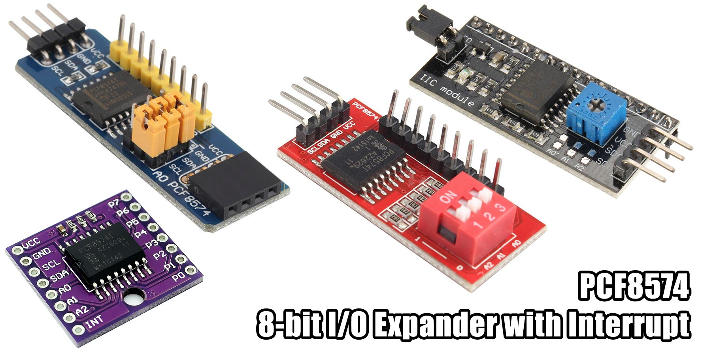

# MicroPython PCF8574

A MicroPython library for PCF8574 8-Bit I2C I/O Expander with Interrupt.



The PCF8574 consists of a 8-bit quasi-bidirectional port and an I2C-bus interface.

The device includes latched outputs with high current drive capability for directly driving LEDs.

The interrupt has an open-drain output, which means you need a pull-up on your microcontroller
to detect when the PCF8574 drives it LOW.

When setting a pin HIGH, it acts as both output AND input. The pin internally uses a weak
current-source pull-up to latch output HIGH.
When driven LOW, for example, with a push button, the pin will read as LOW.

An interrupt fires on any rising or falling edge of the pins in input mode (HIGH).
Interrupt is cleared when the pins are changed or the port is read.

At power on, all pins are driven HIGH and can be immediately used as inputs.

Operating voltage: 2.5V - 5.5V

## Example

Copy the file to your device, using ampy, rshell, webrepl or compiling and deploying. eg.

```bash
$ ampy put pcf8574.py
```

**Basic Usage**

```python
import pcf8574
from machine import I2C, Pin

# TinyPICO (ESP32)
i2c = I2C(scl=Pin(22), sda=Pin(21))
pcf = pcf8574.PCF8574(i2c, 0x20)

# read pin 2
pcf.pin(2)

# set pin 3 HIGH
pcf.pin(3, 1)

# set pin 4 LOW
pcf.pin(4, 0)

# toggle pin 5
pcf.toggle(5)

# set all pins at once with 8-bit int
pcf.port = 0xff

# read all pins at once as 8-bit int
pcf.port
```

For more detailed examples, see [examples](/examples).

#### Pins

Pin  | Type | Description
:---:|:----:|:----------------------------------------
A0   | I    | Address select 1, connect to VCC or GND
A1   | I    | Address select 2, connect to VCC or GND
A2   | I    | Address select 3, connect to VCC or GND
INT  | O    | Interrupt output, open drain, active LOW
P00  | I/O  | Port A, Pin 0
P01  | I/O  | Port A, Pin 1
P02  | I/O  | Port A, Pin 2
P03  | I/O  | Port A, Pin 3
P04  | I/O  | Port A, Pin 4
P05  | I/O  | Port A, Pin 5
P06  | I/O  | Port A, Pin 6
P07  | I/O  | Port A, Pin 7
SDA  | I/O  | I2C Serial Data, needs pull-up
SCL  | I    | I2C Serial Clock, needs pull-up
GND  | PWR  | Ground
VCC  | PWR  | Supply voltage 3.3-5V

## Methods

Construct with a reference to I2C and set the device address.
Valid address range 0x20-0x27.
If are you not sure what it is, run an `i2c.scan()`.
See below for address selection.
```python
__init__(i2c, address=0x20)
```

Method for getting or setting a single pin.
If no value is provided, the port will be read and value of specified pin returned.
If a value is provided, the port will be updated and device written to.
The port is written to after each call. If you intend to toggle many pins at once, use the
port property instead. See below.
Valid pin range 0-7.
```python
pin(pin, value=None)
```

Method for flipping the value of a single pin.
Valid pin range 0-7.
```python
toggle(pin)
```

Private method for loading _port from the device.
```python
_read()
```

Private method for sending _port to the device.
```python
_write()
```

## Properties

Getter reads the port from the device and returns a 8-bit integer.
```python
port
```

Setter writes an 8-bit integer representing the port to the device.
If you are setting multiple pins at once, use this instead of the pin() method as
this writes the entire 8-bit port to the device once, rather than 8 separate writes.
```python
port = 0xffff
```

## Ports

* P00-P07 - Port A

This chip only has one port. If you need more pins, the [PCF8575](https://github.com/mcauser/micropython-pcf8575) has two ports (another 8 pins).

## Interrupts

* INT - Active LOW

## I2C Interface

If you are using a module, most contain 10k pull-ups on the SCL and SDA lines.

If you are using the PCF8574 chip directly, you'll need to add your own.

### I2C Address

The chip supports I2C addresses 0x20-0x27 and is customisable using address pins A0, A1, A2

A0  | A1  | A2  | I2C Address
----|-----|-----|------------
GND | GND | GND | 0x20 (default)
3V3 | GND | GND | 0x21
GND | 3V3 | GND | 0x22
3V3 | 3V3 | GND | 0x23
GND | GND | 3V3 | 0x24
3V3 | GND | 3V3 | 0x25
GND | 3V3 | 3V3 | 0x26
3V3 | 3V3 | 3V3 | 0x27

## Parts

* [TinyPICO](https://www.tinypico.com/) $20.00 USD
* [PCF8574 10x DIP](https://www.aliexpress.com/item/32933373566.html) $3.00 AUD
* [PCF8574 blue board](https://www.aliexpress.com/item/32224660654.html) $0.83 AUD
* [PCF8574 red board](https://www.aliexpress.com/item/32441163158.html) $0.95 AUD
* [PCF8574 purple board](https://www.aliexpress.com/item/32805562508.html) $0.99 AUD
* [PCF8574 as LCD backpack](https://www.aliexpress.com/item/32654514649.html) $0.98 AUD

## Connections

TinyPICO | PCF8574 Module
-------- | ----------
21 SDA   | SDA
22 SCL   | SCL
3V3      | VCC
G        | GND
4        | INT (optional)

## Links

* [TinyPICO Getting Started](https://www.tinypico.com/gettingstarted)
* [micropython.org](http://micropython.org)
* [PCF8574 datasheet](docs/pcf8574.pdf)
* [Adafruit Ampy](https://learn.adafruit.com/micropython-basics-load-files-and-run-code/install-ampy)

## License

Licensed under the [MIT License](http://opensource.org/licenses/MIT).

Copyright (c) 2019 Mike Causer
